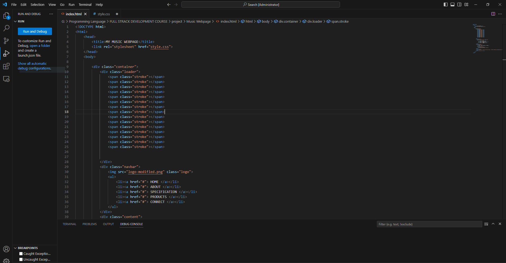
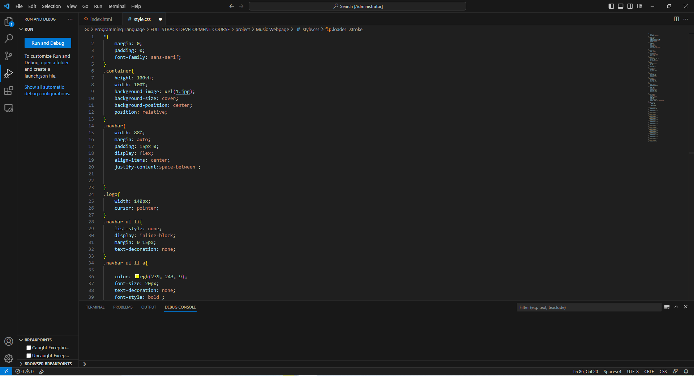
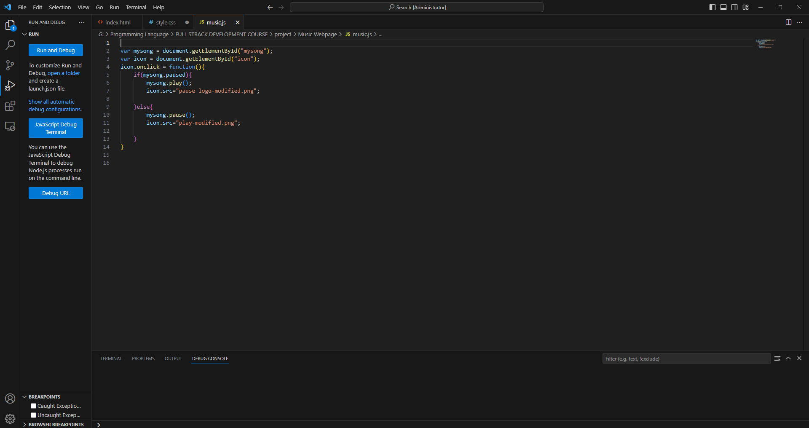
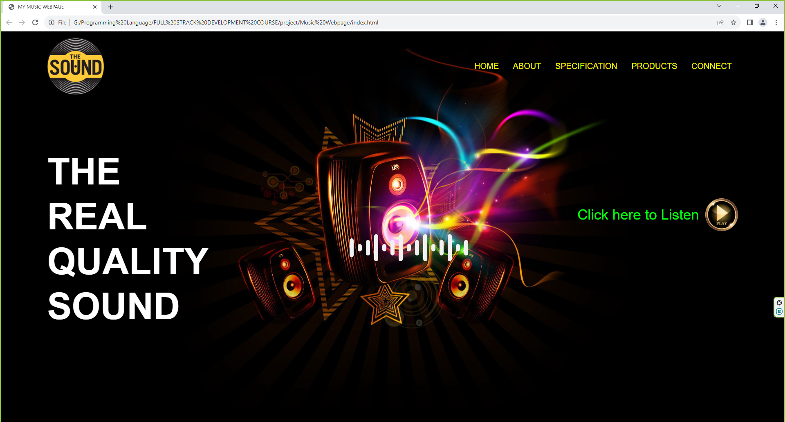

<h1>  Music-Player-Web-Site</h1>

<h4>using html,CSS and Java Script</h4>

<h2>Introduction this Music-Player-Web-Site</h2>
A Music Player Website is an online platform designed to provide users with a convenient and enjoyable way to listen to music over the internet. These websites offer a range of features and functionalities that allow users to discover, organize, and stream music from a vast library of songs and albums.
<h2>Project Code</h2>

<h2>Project GUI</h2>

